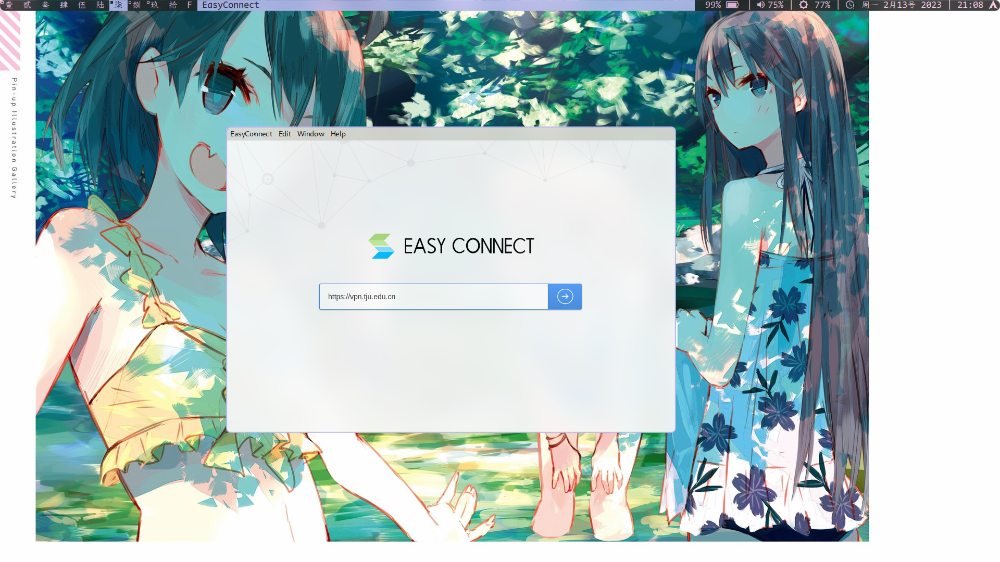
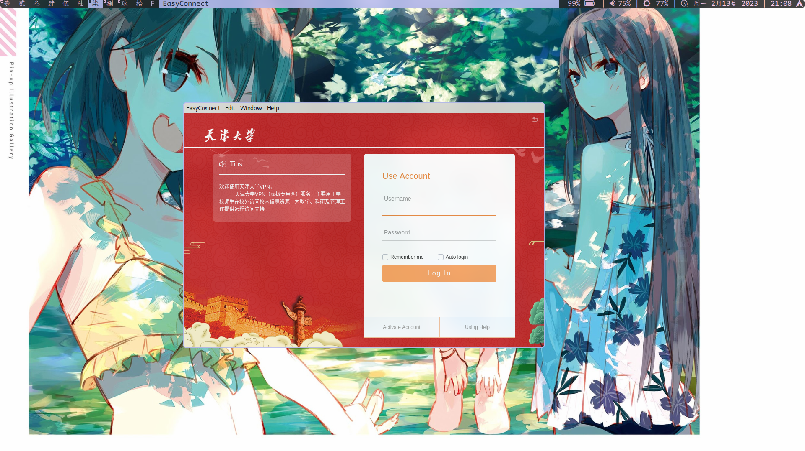
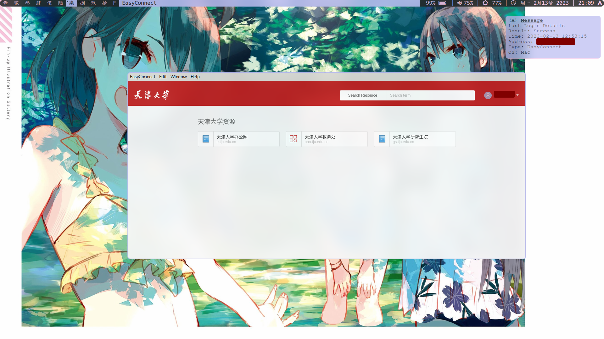
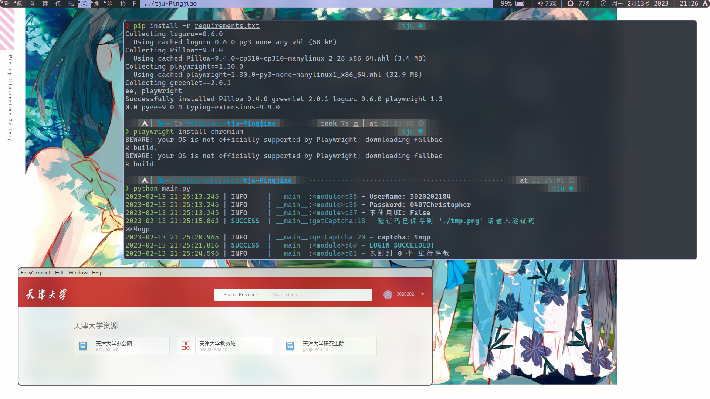

 # TJU 评教脚本

* 本程序只是为了玩一玩 [`PlayWright`](https://playwright.dev/)，并不是为了提高评教速度。

## 文件结构
```
.
├── account.cfg         -- 配置文件，包括学生学号、密码
├── log.log             -- 输出日志
├── main.py             -- 主程序
├── README.md                                           
├── requirements.txt    -- 所需 Python 包
└── tmp.png             -- 验证码截图
```

## 使用说明

### 1.  *校外使用* 连接 TJU 的 VPN
> 校内登录无需此步骤

1. 打开 [`easyconnect`](https://www.sangfor.com.cn/)
> Arch Linux 用户可以在 `aur` 上找到。
2. 输入天津大学 VPN 地址 `https://vpn.tju.edu.cn`并点击按钮。


<!-- <center> -->
<!--   
<!--     src="img/image_2023-02-13-21-08-36.png"><br> -->
<!--   <div style="color:orange; border-bottom: 1px solid #d9d9d9;display: inline-block;color: #999;padding: 2px;">输入天津大学VPN</div> -->
<!-- </center> -->

3. 输入 VPN 帐号密码。

<!-- <center> -->
<!--   
<!--     src="img/image_2023-02-13-21-08-48.png"><br> -->
<!--   <div style="color:orange; border-bottom: 1px solid #d9d9d9;display: inline-block;color: #999;padding: 2px;">输入帐号密码</div> -->
<!-- </center> -->

4. 登录完成。

<!-- <center> -->
<!--   
<!--       src="img/image_2023-02-13-21-09-56.png"><br> -->
<!--   <div style="color:orange; border-bottom: 1px solid #d9d9d9;display: inline-block;color: #999;padding: 2px;">登录完成</div> -->
<!-- </center> -->

### 2. 安装环境
```shell
conda create -n tju
conda activate tju
conda install pip 
pip install -r requirement.txt
playwright install chromium
```

### 3. 查看并填写配置文件
* 创建 cfg 文件
```shell
cp account.cfg.example account.cfg
```
* 修改之
```cfg
[account]
# USERNAME: 学号
USERNAME = xxxxxxxx
# PASSWORD: 密码
PASSWORD = xxxxxxxx

# 是否启用 Headless Mode
# True: 启用 Headless Mode --> 不显示 UI
# False: 不启用 Headless Mode  --> 显示 UI
HEADLESS = False
```

### 4. 运行代码
```
python main.py
```



<!-- <center> -->
<!--   
<!--     src="img/image_2023-02-13-21-26-22.png"><br> -->
<!--   <div style="color:orange; border-bottom: 1px solid #d9d9d9;display: inline-block;color: #999;padding: 2px;">执行效果</div> -->
<!-- </center> -->
